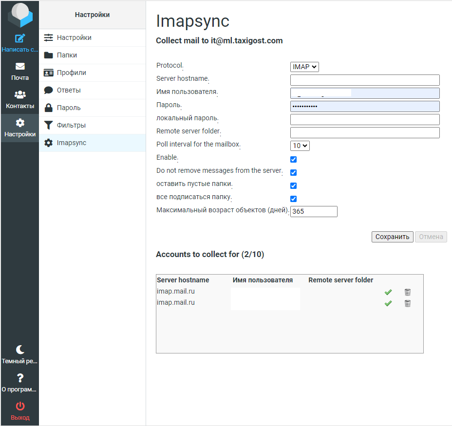

```markdown
# RCimapSync для MIAB с Roundcube и SQLite 🚀

Этот форк плагина RCimapSync позволяет синхронизировать почту из внешних ящиков в системе **Mail-in-a-Box (MIAB)** с использованием **Roundcube** и базы данных **SQLite**. Следуйте этим шагам, чтобы установить и настроить плагин. 🎉

---

## Screenshot




## 📋 Содержание

прежде чем начать

Резервное копирование: Регулярно создавайте резервные копии базы данных SQLite:
  ```bash
  cp /home/user-data/mail/roundcube/roundcube.sqlite ~/Buckup/
  ```

1. [Подготовка среды](#1-подготовка-среды-🛠️)
2. [Установка зависимостей](#2-установка-зависимостей-📦)
3. [Установка утилиты imapsync](#3-установка-утилиты-imapsync-📨)
4. [Скачивание и установка плагина](#4-скачивание-и-установка-плагина-🔌)
5. [Настройка для SQLite](#5-настройка-плагина-для-sqlite-🔧)
6. [Создание таблицы в SQLite](#6-создание-таблицы-в-sqlite-🗃️)
7. [Настройка скрипта imapsync.pl](#7-настройка-скрипта-imapsyncpl-⚙️)
8. [Настройка прав доступа](#8-настройка-прав-доступа-🔐)
9. [Тестирование синхронизации](#9-тестирование-синхронизации-🧪)
10. [Автоматизация синхронизации](#10-автоматизация-синхронизации-🤖)
11. [Публикация форка](#11-публикация-форка-🚢)

---

## 1. Подготовка среды 🛠️

**Цель**: Убедиться, что система MIAB готова к установке плагина.

- Обновите систему:
  ```bash
  sudo apt-get update
  sudo apt-get upgrade -y
  ```
  **Проверка**:  
  ```bash
  echo $?  # Должно вывести 0
  ```
  Убедитесь, что Roundcube работает: откройте `https://your-domain.com/mail` в браузере.

---

## 2. Установка зависимостей 📦

**Цель**: Установить необходимые пакеты и модули.

1. Установите пакеты через apt:
   ```bash
   sudo apt-get install -y cpanminus git makepasswd rcs perl-doc \
   libio-tee-perl libmail-imapclient-perl libdigest-md5-file-perl \
   libterm-readkey-perl libfile-copy-recursive-perl build-essential \
   make automake libunicode-string-perl libauthen-ntlm-perl \
   libcrypt-ssleay-perl libdigest-hmac-perl libio-compress-perl \
   libio-socket-inet6-perl libio-socket-ssl-perl libmodule-scandeps-perl \
   libnet-ssleay-perl libpar-packer-perl libreadonly-perl \
   libtest-pod-perl libtest-simple-perl liburi-perl \
   libencode-imaputf7-perl libfile-tail-perl libproc-processtable-perl \
   libregexp-common-perl libsys-meminfo-perl libtest-deep-perl libdbd-sqlite3-perl
   ```

   **Проверка**:  
   ```bash
   dpkg -l | grep libencode-imaputf7-perl
   ```

2. Установите Perl-модули через cpanm:
   ```bash
   sudo cpanm -i JSON::WebToken Test::MockObject Unicode::String Data::Uniqid
   ```

   **Проверка**:  
   ```bash
   perl -MJSON::WebToken -e 'print "OK\n"'
   ```

---

## 3. Установка утилиты imapsync 📨

**Цель**: Установить imapsync для синхронизации почты.

```bash
cd /tmp
git clone https://github.com/imapsync/imapsync.git
cd imapsync
mkdir dist
make install
```

**Проверка**:  
```bash
which imapsync  # Должно вывести /usr/local/bin/imapsync
```

---

## 4. Скачивание и установка плагина 🔌

**Цель**: Установить форк плагина RCimapSync.

```bash
cd /usr/local/lib/roundcubemail/plugins
git clone https://github.com/usliders/Roundcube-Mail-IMAPSYNC-Plugin-SQLite-Mail-in-a-box.git imapsync
```

**Проверка**:  
```bash
ls -l /usr/local/lib/roundcubemail/plugins/imapsync
```

---

## 5. Настройка плагина для SQLite 🔧

**Цель**: Адаптировать плагин для работы с SQLite.

1. Откройте конфигурационный файл:
   ```bash
   mcedit /usr/local/lib/roundcubemail/plugins/imapsync/bin/config.conf
   ```

2. Укажите путь к базе данных:
   ```php   
   $db_file = "/home/user-data/mail/roundcube/roundcube.sqlite";
   ```

**Проверка пути**:  
```bash
ls -l /home/user-data/mail/roundcube/roundcube.sqlite
```

---

## 6. Создание таблицы в SQLite 🗃️

**Цель**: Создать таблицу для хранения настроек.

  6.1. Подключитесь к базе:
   ```bash
   sqlite3 /home/user-data/mail/roundcube/roundcube.sqlite
   ```

  6.2. Выполните SQL-запрос:
   ```sql
   CREATE TABLE IF NOT EXISTS imapsync (
       id INTEGER PRIMARY KEY AUTOINCREMENT,
       mailbox TEXT NOT NULL,
       active INTEGER NOT NULL DEFAULT 1,
       src_server TEXT NOT NULL,
       src_auth TEXT NOT NULL DEFAULT 'password',
       src_user TEXT NOT NULL,
       src_password TEXT NOT NULL,
       src_folder TEXT NOT NULL,
       dest_password TEXT NOT NULL,
       poll_time INTEGER NOT NULL DEFAULT 10,
       fetchall INTEGER NOT NULL DEFAULT 0,
       keep INTEGER NOT NULL DEFAULT 1,
       protocol TEXT NOT NULL DEFAULT 'IMAP',
       subscribeall INTEGER NOT NULL DEFAULT 1,
       skipempty INTEGER NOT NULL DEFAULT 1,
       maxage INTEGER NOT NULL DEFAULT 365,
       usessl INTEGER NOT NULL DEFAULT 1,
       sslcertck INTEGER NOT NULL DEFAULT 0,
       sslcertpath TEXT,
       sslfingerprint TEXT,
       extra_options TEXT,
       returned_text TEXT,
       mda TEXT NOT NULL DEFAULT '',
       date TIMESTAMP NOT NULL DEFAULT CURRENT_TIMESTAMP
   );
   ```

**Проверка**:  
```bash
sqlite3 /home/user-data/mail/roundcube/roundcube.sqlite ".tables"
```
---

## 7. Настройка скрипта imapsync.pl ⚙️ -опционально-

**Цель**: Адаптировать скрипт для SQLite.

1. Откройте файл скрипта:
   ```bash
   mcedit /usr/local/lib/roundcubemail/plugins/imapsync/bin/imapsync.pl
   ```

2. Убедитесь в корректности подключения к БД:
   ```perl
   my $DBH = DBI->connect("DBI:SQLite:dbname=$Conf::db_file", "", "") || &log_and_die("cannot connect to database");
   ```

---

## 8. Настройка прав доступа 🔐

**Цель**: Установить правильные права.

```bash
sudo chown www-data:www-data /home/user-data/mail/roundcube/roundcube.sqlite
sudo chmod 660 /home/user-data/mail/roundcube/roundcube.sqlite
sudo chown -R www-data:www-data /usr/local/lib/roundcubemail/plugins/imapsync
```

**Проверка**:  
```bash
ls -l /home/user-data/mail/roundcube/roundcube.sqlite
```

---

## 9. Тестирование синхронизации 🧪

**Цель**: Проверить работу синхронизации.

```bash
sudo -u www-data /usr/bin/perl /usr/local/lib/roundcubemail/plugins/imapsync/bin/imapsync.pl
```

или просто

```bash
cd /usr/local/lib/roundcubemail/plugins/imapsync/bin
perl ./imapsync.pl
```

**Проверка логов**:  
```bash
sudo tail -f /var/log/syslog | grep imapsync
sudo cat /usr/local/lib/roundcubemail/plugins/imapsync/bin/LOG_imapsync/imapsync.log
```

---

## 10. Автоматизация синхронизации 🤖

**Цель**: Настроить автоматический запуск.

1. Добавьте задание в cron:
   ```bash
   sudo crontab -e -u www-data
   ```

2. Вставьте строку:
   ```cron
   */30 * * * * /usr/bin/perl /usr/local/lib/roundcubemail/plugins/imapsync/bin/imapsync.pl
   ```

**Проверка**:  
```bash
sudo crontab -l -u www-data
```

---

## 🎉 Заключение

Если возникнут вопросы, создавайте **Issues** в репозитории. Удачной синхронизации! ✨

```

## Полезные команды

```sqlite
вход в бд
* sqlite3 /home/user-data/mail/roundcube/roundcube.sqlite
проверка записей
* sqlite> SELECT * FROM imapsync WHERE mailbox = 'test@example.com';
добавление в ручную в БД
* INSERT INTO imapsync (mailbox, active, keep, protocol, src_server, src_auth, src_user, src_password, src_folder, dest_password, poll_time, fetchall, usessl, subscribeall, skipempty, maxage, date) VALUES ('test@example.com', 1, 1, 'IMAP', 'imap.example.com', 'password', 'test@example.com', 'YmFzZTY0X3Bhc3N3b3Jk', 'INBOX', 'YmFzZTY0X2Rlc3RfcGFzc3dvcmQ=', 10, 0, 1, 1, 1, 365, datetime('now', '-1 hour'));
проверьте активные записи
* SELECT * FROM imapsync WHERE active = 1;
```

получаем кодированный пароль
```bash
echo -n "your_password" | base64
```

корректировать дизайн
/usr/local/lib/roundcubemail/plugins/imapsync/skins/elastic/templates/imapsync.html

```